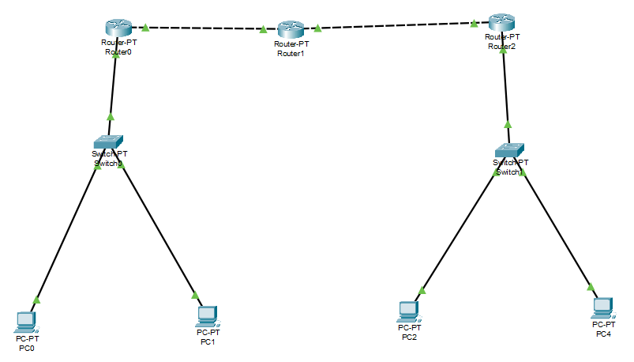
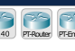
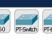
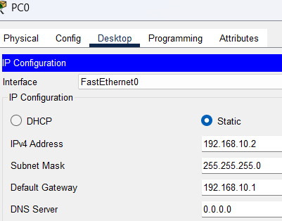
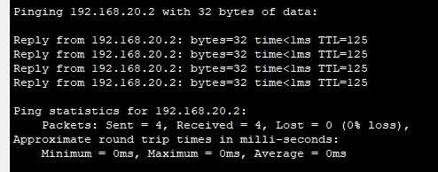

# Laporan Proyek Cisco Packet Tracer  
## Topologi Jaringan 3 Router, 2 Switch, 4 PC

---

## 1. Pendahuluan
Dalam proyek ini, dilakukan simulasi jaringan menggunakan **Cisco Packet Tracer** dengan tujuan untuk memahami cara menghubungkan beberapa jaringan lokal (LAN) menggunakan **router sebagai penghubung antar jaringan**.  
Topologi yang dibuat terdiri dari:
- 3 Router
- 2 Switch
- 4 PC

Setiap LAN memiliki alamat IP berbeda dan dihubungkan melalui **Router PT** menggunakan kabel **crossover** antar router.  
Dengan konfigurasi routing (static route), semua PC dapat saling berkomunikasi antar jaringan.

---

## 2. Penjelasan Komponen

### a. Router PT
Digunakan untuk menghubungkan antar jaringan. Router PT memiliki interface FastEthernet (atau GigabitEthernet) yang dapat dikonfigurasi dengan alamat IP. Router juga digunakan untuk melakukan routing agar jaringan berbeda bisa saling terhubung.

### b. Switch
Bertindak sebagai penghubung antar perangkat dalam satu jaringan lokal (LAN). Switch bekerja pada Layer 2 (Data Link Layer) untuk meneruskan frame berdasarkan alamat MAC.

### c. PC (End Device)
Sebagai host (end-user) yang terhubung ke jaringan. Digunakan untuk melakukan pengujian konektivitas (ping, komunikasi data).

### d. Kabel
- **Straight-Through**: digunakan untuk menghubungkan PC ↔ Switch ↔ Router.  
- **Crossover**: digunakan untuk menghubungkan Router ↔ Router.  

---

## 3. Instalasi Jaringan

### Langkah-langkah:
1. Buka Cisco Packet Tracer.
2. Tambahkan perangkat:
   - 3 Router PT (Router0, Router1, Router2).
   - 2 Switch (Switch0, Switch1).
   - 4 PC (PC0–PC3).
3. Hubungkan perangkat:
   - Router0 ↔ Switch0 ↔ PC0, PC1 (Straight).
   - Router2 ↔ Switch1 ↔ PC2, PC3 (Straight).
   - Router0 ↔ Router1 (Crossover).
   - Router1 ↔ Router2 (Crossover).
4. Atur alamat IP sesuai skema.

---

## 4. Konfigurasi Jaringan

### a. Skema IP Address
- **LAN1 (192.168.10.0/24)**  
  - Router0 Fa0/0: `192.168.10.1`  
  - PC0: `192.168.10.2` (GW: 192.168.10.1)  
  - PC1: `192.168.10.3` (GW: 192.168.10.1)  

- **LAN2 (192.168.20.0/24)**  
  - Router2 Fa0/0: `192.168.20.1`  
  - PC2: `192.168.20.2` (GW: 192.168.20.1)  
  - PC3: `192.168.20.3` (GW: 192.168.20.1)  

- **Link Router0 ↔ Router1 (192.168.30.0/30)**  
  - Router0 Fa0/1: `192.168.30.1`  
  - Router1 Fa0/0: `192.168.30.2`  

- **Link Router1 ↔ Router2 (192.168.40.0/30)**  
  - Router1 Fa0/1: `192.168.40.1`  
  - Router2 Fa0/1: `192.168.40.2`  

---

### b. Konfigurasi Router

#### Router0
enable
configure terminal
interface fastEthernet0/0
ip address 192.168.10.1 255.255.255.0
no shutdown
exit
interface fastEthernet0/1
ip address 192.168.30.1 255.255.255.252
no shutdown
exit
ip route 192.168.20.0 255.255.255.0 192.168.30.2
end
write

#### Router1
enable
configure terminal
interface fastEthernet0/0
ip address 192.168.30.2 255.255.255.252
no shutdown
exit
interface fastEthernet0/1
ip address 192.168.40.1 255.255.255.252
no shutdown
exit
ip route 192.168.10.0 255.255.255.0 192.168.30.1
ip route 192.168.20.0 255.255.255.0 192.168.40.2
end
write

#### Router2
enable
configure terminal
interface fastEthernet0/0
ip address 192.168.20.1 255.255.255.0
no shutdown
exit
interface fastEthernet0/1
ip address 192.168.40.2 255.255.255.252
no shutdown
exit
ip route 192.168.10.0 255.255.255.0 192.168.40.1
end
write

---

### c. Konfigurasi PC
- PC0: IP `192.168.10.2`, Mask `255.255.255.0`, Gateway `192.168.10.1`  
- PC1: IP `192.168.10.3`, Mask `255.255.255.0`, Gateway `192.168.10.1`  
- PC2: IP `192.168.20.2`, Mask `255.255.255.0`, Gateway `192.168.20.1`  
- PC3: IP `192.168.20.3`, Mask `255.255.255.0`, Gateway `192.168.20.1`  

---

## 5. Pengujian
Pengujian dilakukan dengan perintah `ping` dari PC ke PC lain lintas jaringan.

- **PC0 → PC2** ✅ Reply  
- **PC1 → PC3** ✅ Reply  
- **PC0 → PC3** ✅ Reply  

Artinya konfigurasi routing sudah benar dan semua jaringan dapat saling berkomunikasi.

---

## 6. Penutup
Dalam proyek ini berhasil dibangun simulasi jaringan dengan 3 router, 2 switch, dan 4 PC menggunakan Cisco Packet Tracer.  
Hasil konfigurasi menunjukkan bahwa:
- Router PT dapat digunakan untuk menghubungkan beberapa LAN.  
- Static route berhasil digunakan untuk memungkinkan komunikasi antar jaringan.  
- Semua PC dalam jaringan yang berbeda dapat saling berkomunikasi.  

**Kesimpulan:**  
Simulasi ini menunjukkan konsep dasar interkoneksi antar jaringan menggunakan router. Dengan pemahaman ini, dapat dikembangkan ke penggunaan routing dinamis (RIP, OSPF, EIGRP) untuk skala jaringan yang lebih besar.

---

