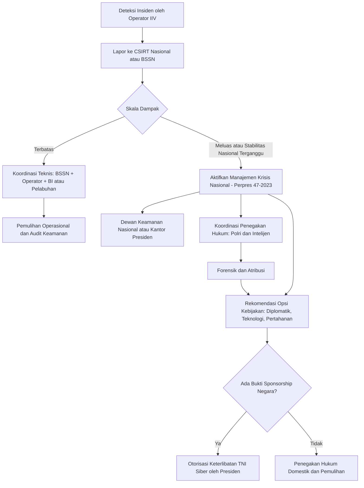
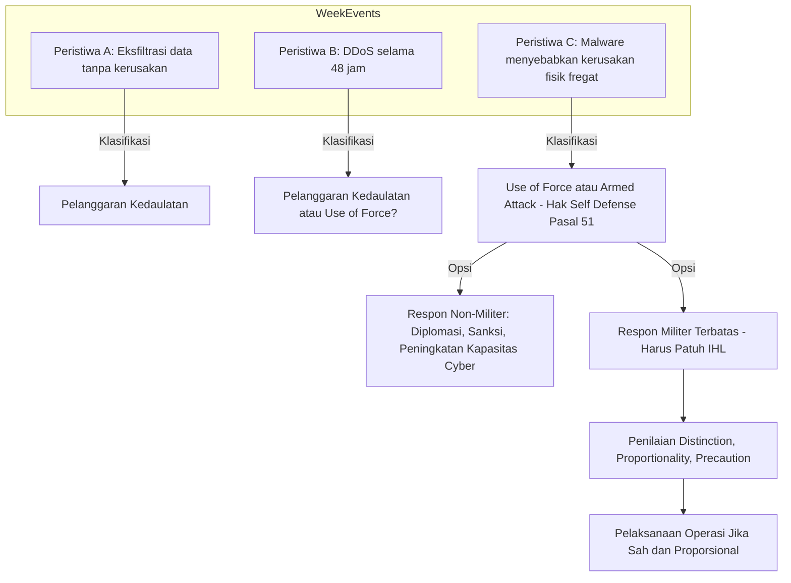
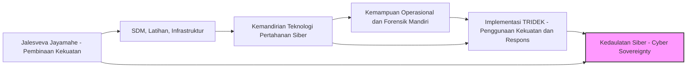
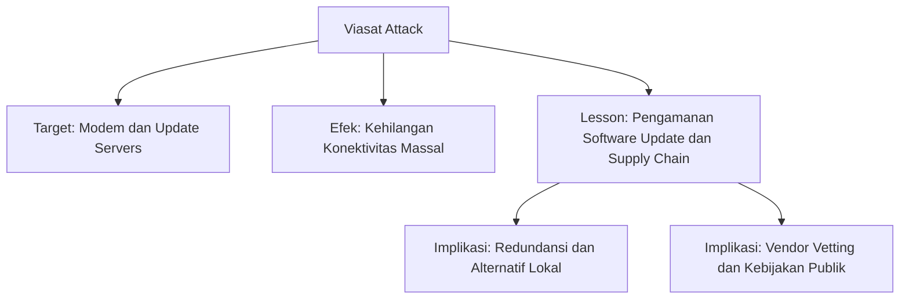
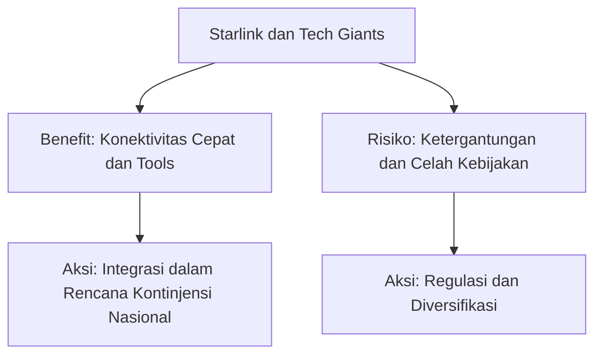
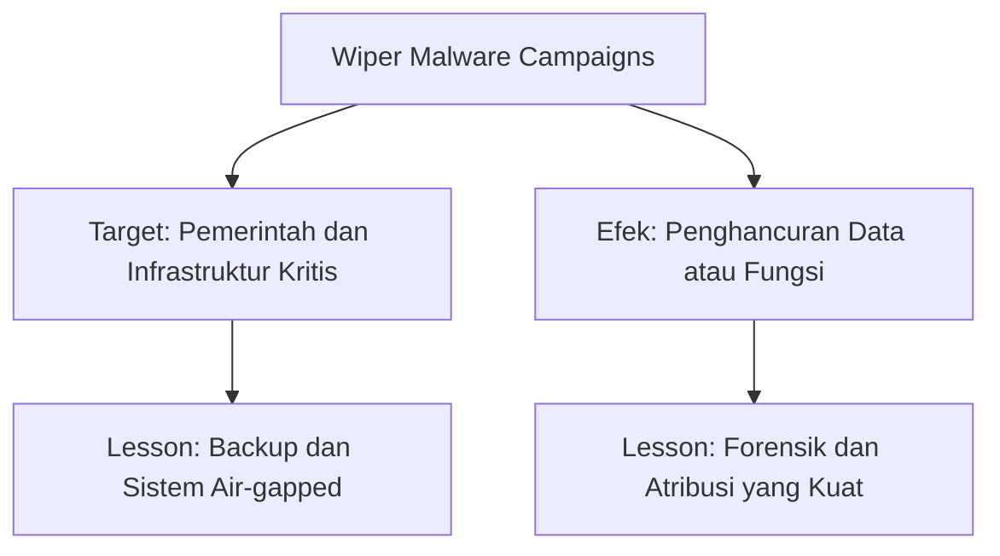

# Bagian A — Soal Latihan

## I. Pilihan Ganda (jawaban yang paling tepat)

1. **c. Mengidentifikasi dan menetapkan kewajiban pelindungan terhadap Infrastruktur Informasi Vital (IIV).** ([BPK Regulation][1])
2. **c. Hak inheren untuk membela diri (*self-defense*) sesuai Pasal 51 Piagam PBB, yang dapat mencakup respons militer.** (interpretasi Tallinn Manual 2.0: bila operasi siber setara efeknya dengan serangan bersenjata → hak pembelaan diri). ([Cambridge University Press & Assessment][2])
3. **d. Pembedaan (*Distinction*).** (menargetkan infrastruktur fungsi-ganda memicu masalah pembedaan antara sasaran militer & sipil). ([ICRC][3])
4. **b. TRIDEK adalah doktrin penggunaan kekuatan siber, sementara Jalesveva Jayamahe adalah doktrin pembinaan kekuatan siber.** (pilihan ini cocok dengan penekanan TRIDEK pada penggunaan/operasi dan Jalesveva pada pembinaan/ketahanan TNI AL). *(Catatan: untuk skripsi, periksa doktrin resmi TNI/TNI AL sebagai referensi primer.)* ([alika.pesisirbaratkab.go.id][4])
5. **c. Operasi siber-kinetik terintegrasi yang bertujuan mengganggu komando dan kendali musuh.** (kasus Viasat adalah contoh mengganggu C2/komunikasi sebelum operasi kinetik). ([cyberconflicts.cyberpeaceinstitute.org][5])

---

## II. Esai Singkat (2–4 kalimat masing-masing)

6. **Dua fungsi utama Perpres No. 47/2023**
   Perpres 47/2023 menetapkan (1) *Strategi Keamanan Siber Nasional* untuk menyelaraskan kebijakan, pembinaan kapabilitas, dan pembagian peran antar-pemangku kepentingan; dan (2) *Manajemen Krisis Siber* sebagai kerangka koordinatif untuk mendeteksi, merespons, serta memitigasi insiden siber skala besar. Kedua fungsi ini bertujuan menjamin kesiapsiagaan dan stabilitas infrastruktur nasional selama krisis siber. ([BPK Regulation][6])

7. **Perbedaan kedaulatan vs use of force (Tallinn Manual 2.0)**
   **Pelanggaran kedaulatan** berarti campur tangan yang melanggar integritas wilayah atau kontrol negara atas sistemnya (mis. intrusi tanpa efek fisik besar), sedangkan **use of force** / **armed attack** memerlukan tingkat *skala dan efek* yang setara dengan penggunaan kekuatan tradisional (mis. kerusakan fisik yang parah, korban jiwa, atau gangguan fungsi negara yang signifikan). Ambang ini ditentukan oleh kombinasi *skala* dan *efek*. ([Cambridge University Press & Assessment][2])

8. **Falasi "Perang Bersih" (Clean War Fallacy)**
   Falasi ini ialah anggapan bahwa operasi siber dapat dilakukan sehingga hanya menimbulkan kerusakan teknis minimal tanpa konsekuensi sipil atau moral — padahal serangan siber sering memicu dampak tak terduga terhadap layanan sipil (mis. rumah sakit, distribusi listrik). Menganggap perang siber “bersih” berbahaya karena meremehkan risiko terhadap warga sipil dan mengikis akuntabilitas hukum serta etika. ([ICRC][7])

9. **Kemandirian Teknologi Pertahanan Siber & Kedaulatan Siber**
   Kemandirian teknologi (mis. kemampuan R&D, supply chain lokal untuk perangkat & perangkat lunak kritikal) mengurangi ketergantungan pada vendor asing sehingga negara mempertahankan kontrol operasional dan kebijakan atas infrastruktur kritis — sebuah prasyarat agar klaim *kedaulatan siber* bukan sekadar retorika, tetapi dapat diwujudkan secara teknis dan kebijakan. ([Belfer Center][8])

10. **Peran sektor swasta internasional (contoh: Microsoft, Starlink) & implikasi**
    Perusahaan teknologi menyediakan kapabilitas — mulai dari dukungan layanan (Starlink) hingga intelijen & patching (Microsoft) — yang menjadi komponen vital dalam respons & ketahanan; implikasinya: negara modern harus mengembangkan kerangka kerjasama publik-swasta, mekanisme legal untuk akses/koordinasi, serta strategi mitigasi ketergantungan terhadap aktor komersial. Kasus ini menegaskan perlunya kebijakan untuk mengatur peran komersial dalam krisis keamanan nasional. ([Belfer Center][8])

---

# Bagian B — Tugas Analisis dan Studi Kasus

---

## Tugas 1 — Analisis Kerangka Regulasi Nasional dalam Krisis Siber

**Skenario singkat:** ransomware terkoordinasi, diduga disponsori negara asing, melumpuhkan Pelabuhan Tanjung Priok & sistem kliring Bank Indonesia → perdagangan/keuangan terhenti.

### 1) Mengapa ini memenuhi kriteria **Infrastruktur Informasi Vital (IIV)** menurut Perpres 82/2022?

* **Perpres 82/2022** mendefinisikan dan mengatur pelindungan IIV dan menempatkan sektor-sektor kritikal (transportasi, keuangan, energi, telekomunikasi, dsb.) sebagai bagian IIV yang wajib dilindungi. Pelabuhan (logistik & rantai pasok nasional) dan sistem kliring bank sentral (stabilitas moneter & transaksi nasional) jelas termasuk kategori IIV karena gangguan keduanya berdampak pada hajat hidup orang banyak dan keamanan nasional. Oleh karena itu insiden ransomware yang mengguncang kedua sektor tersebut memenuhi definisi IIV dan harus ditangani sesuai ketentuan Perpres. ([BPK Regulation][1])

### 2) Bagaimana insiden akan dikelola menurut mekanisme **Manajemen Krisis Siber Nasional** (Perpres 47/2023)?

Ringkasan alur pengelolaan (sesuai Perpres 47/2023):

* **Deteksi & Pelaporan awal**: operator IIV wajib melaporkan insiden ke CSIRT nasional/instansi terkait sesuai prosedur.
* **Koordinasi Nasional**: BSSN (sebagai koordinator perlindungan IIV) memimpin koordinasi teknis dan informasi antar-instansi (Kemenhub/pelabuhan, Bank Indonesia, Kemenkeu, Polri, Kemenhan bila perlu).
* **Manajemen Krisis**: jalur eskalasi menuju Dewan Keamanan Nasional atau gugus tugas krisis nasional bila dampak meluas; Perpres 47 mengatur pembentukan struktur manajemen krisis untuk respon terpadu.
* **Mitigasi & Pemulihan**: tindakan mitigasi teknis (isolasi, per-backing, decryptor/restore) serta komunikasi publik untuk mengurangi kepanikan.
* **Penegakan Hukum & Intelijen**: KLN/Kepolisian dan intelijen siber menindak serta mengumpulkan bukti; bila ada indikasi aktor negara, aspek diplomatik/ketahanan akan diaktifkan. ([BPK Regulation][6])

### 3) Peran BSSN dan kapan unit siber TNI dapat dilibatkan secara sah?

* **Peran BSSN:** koordinator pelindungan IIV (Perpres 82/2022) dan salah satu pusat pengendali manajemen krisis siber; BSSN mengorganisir CSIRT nasional, menyediakan analisis teknis, rekomendasi mitigasi, serta fasilitasi koordinasi antar-pemangku kepentingan. BSSN juga bertugas memberi rekomendasi kepada Presiden bila insiden bereskalasi menjadi ancaman nasional. ([BPK Regulation][1])
* **Keterlibatan unit siber TNI:** TNI (termasuk unit siber) dapat dilibatkan jika insiden telah menyeberang dari ranah sipil ke kedaulatan/pertahanan negara (mis. bila ada bukti sponsorship negara asing yang mengakibatkan kerusakan fisik atau ancaman terhadap kemampuan pertahanan nasional). Keterlibatan TNI harus sesuai UU dan peraturan yang mengatur penggunaan TNI, serta harus diotorisasi melalui mekanisme eskalasi (Presiden/Dewan Keamanan Nasional atau penugasan resmi). Singkatnya: keterlibatan sah ketika isu sudah masuk dimensi pertahanan/kedaulatan dan otorisasi politik-legal tersedia. ([Setkab][9])

### 4) Rekomendasi operasional & kebijakan (ringkas)

* **Segera** aktivasi CSIRT nasional & koordinasi BSSN–BI–Pelabuhan–Polri. (teknis: isolasi segmen terinfeksi; forensik; restore dari backup terverifikasi).
* **Penyelidikan atribusi terpadu** (BSSN + Polri + intelijen) untuk mengumpulkan bukti sponsor asing.
* **Komunikasi publik terkoordinasi** untuk menahan kepanikan pasar.
* **Siapkan opsi kebijakan** (diplomatik/koersif/retaliasi terbatas) bila atribusi mengarah ke aktor negara — langkah ini harus melalui kajian hukum internasional (Tallinn Manual) dan otorisasi nasional.
* **Perkuat kemandirian teknologi** (backup lokal, alternatif clearing paths, redundansi komunikasi) sebagai mitigasi jangka menengah. ([BPK Regulation][6])

### 5) Diagram Mermaid — Alur eskalasi & respons kelembagaan

**Sumber utama:** Perpres 82/2022 & Perpres 47/2023 (teks resmi) dan penjelasan BSSN. ([BPK Regulation][1])

---

## Tugas 2 — Aplikasi Kerangka Hukum Internasional (Tallinn Manual 2.0)

**Skenario:** Negara Pandawa mengalami tiga peristiwa A, B, C dalam seminggu.

### Ringkasan analisis menurut Tallinn Manual 2.0 (fokus: pelanggaran kedaulatan / use of force / armed attack)

**Prinsip dasar**: Tallinn Manual menilai ambang hukum berdasarkan *skala* dan *efek* operasi siber — intrusi pasif/espionage biasanya pelanggaran kedaulatan, DDoS yang mengganggu layanan bisa masuk pelanggaran kedaulatan atau use of force tergantung efek; operasi yang menimbulkan kerusakan fisik/cedera/correspond to kinetic effects dapat mencapai ambang *armed attack* sehingga memicu Pasal 51. ([Cambridge University Press & Assessment][2])

---

### Peristiwa A: Eksfiltrasi data teknis fregat — *intrusi jangka panjang*, tidak ada kerusakan.

**Analisis hukum:** **Pelanggaran Kedaulatan (Sovereignty violation)**; lebih tepat dikategorikan sebagai intelijen/-spionase siber — meskipun ilegal dan berbahaya, belum memenuhi ambang *use of force* atau *armed attack* karena tidak ada efek fisik atau gangguan fungsi yang signifikan. Tallinn Manual menempatkan eksfiltrasi non-merusak pada pelanggaran kedaulatan (interference) bukan penggunaan kekuatan. ([ilmc.univie.ac.at][10])

**Justifikasi:** tidak ada kerusakan, korban, atau gangguan operasional besar → efeknya intelijen/kerahasiaan, bukan penggunaan kekerasan. ([Georgetown Law][11])

---

### Peristiwa B: DDoS melumpuhkan situs & rekrutmen selama 48 jam.

**Analisis hukum:** **Kemungkinan Pelanggaran Kedaulatan / atau Use of Force (bergantung efek)** — mayoritas ahli memandang DDoS yang menyebabkan gangguan administratif (downtime) tanpa kerusakan fisik sebagai pelanggaran kedaulatan atau tindak perbuatan yang dapat dikategorikan *malicious cyber operation*, tetapi belum tentu *use of force* kecuali dampaknya mencapai skala/efek yang sebanding dengan serangan bersenjata (mis. menyebabkan kerugian ekonomi masif, kegagalan fungsi sistem kritikal). Dalam contoh 48 jam situs lumpuh → kemungkinan besar *pelanggaran kedaulatan*; jika DDoS juga mengganggu sistem militer atau keselamatan publik → bisa mendekati ambang *use of force*. ([Georgetown Law][11])

**Justifikasi:** efek temporer (48 jam) pada layanan administratif → belum setara dengan kerusakan fisik signifikan, jadi klasifikasi lebih rendah. ([Georgetown Law][11])

---

### Peristiwa C: Malware via spear-phishing mengakibatkan kerusakan fisik fregat (overheat) dan tidak dapat beroperasi berbulan-bulan.

**Analisis hukum:** **Serangan Bersenjata (Armed Attack)** atau setidaknya *use of force* yang mencapai ambang tingkat serangan bersenjata menurut Tallinn Manual.
**Justifikasi:** malware menyebabkan **kerusakan fisik signifikan** pada aset militer (fregat), mengurangi kemampuan tempur → efek setara kerusakan akibat serangan kinetik; oleh karena itu masuk pada ambang *use of force* dan kemungkinan *armed attack*, memicu hak pembelaan diri menurut Pasal 51 Piagam PBB. ([Cambridge University Press & Assessment][2])

---

### 2) Untuk Peristiwa C — hak Negara Pandawa menurut Pasal 51 Piagam PBB

Negara Pandawa berhak atas **hak inheren untuk pembelaan diri** (individual/collective self-defense) sampai Dewan Keamanan mengambil tindakan; tindakan defensif dapat mencakup balasan militer yang proporsional dan diperlukan untuk menghentikan atau membalas serangan bersenjata. Semua langkah pembelaan harus dilaporkan ke Dewan Keamanan. ([United Nations Legal Affairs][12])

---

### 3) Jika merespons militer (termasuk operasi siber balasan) — prinsip Hukum Humaniter Internasional yang harus dipatuhi & tantangan aplikasinya

**Prinsip yang harus dipatuhi** (ringkas):

* **Distinction (Pembedaan):** bedakan sasaran militer vs objek sipil.
* **Necessity & Proportionality:** hanya serang yang perlu untuk tujuan militer dan hindari kerusakan sipil yang berlebihan.
* **Humanity / Martabat:** hindari tindakan yang menyebabkan penderitaan yang tidak perlu.
* **Precaution:** lakukan langkah pencegahan untuk meminimalkan dampak sipil. ([ICRC][13])

**Tantangan penerapan prinsip *Distinction* di ruang siber (contoh):**
Menentukan apakah sebuah sistem jaringan tertentu adalah *military objective* sulit karena banyak infrastruktur berbagi fungsi sipil & militer (dual-use). Selain itu, efek samping operasi siber bisa menyebar lewat dependencies (mis. melumpuhkan grid listrik regional), sehingga membedakan target militer murni dari objek sipil terdampak adalah tantangan teknis & intelijen besar — risiko kerusakan sipil tidak disengaja tinggi. Ini membuat penilaian pembedaan sebelum operasi siber menjadi kompleks. ([cyberlaw.ccdcoe.org][14])

---

### 4) Diagram Mermaid — Analisis eskalasi Peristiwa A/B/C

**Sumber & rujukan:** Tallinn Manual 2.0 (analisis *use of force* & ambang armed attack), UN Charter Art.51 (self-defense), ICRC/ICJ bahan tentang IHL & prinsip distinction. ([Cambridge University Press & Assessment][2])

---

## Tugas 3 — Sintesis Doktrin, Kedaulatan, dan Kemandirian Teknologi

### 1) Cara **Jalesveva Jayamahe** (pembinaan) & **TRIDEK** (penggunaan) bekerja sinergis untuk Kedaulatan Siber

* **Jalesveva Jayamahe (TNI AL — pembinaan kekuatan):** fokus pada pembangunan kapabilitas, latihan, kesiapan sumber daya manusia, infrastruktur pertahanan laut/siber dan ketahanan operasional jangka panjang.
* **Tri Dharma Eka Karma (TRIDEK — penggunaan kekuatan):** memberi dorongan doktrinal untuk bagaimana TNI menggunakan kekuatan (termasuk siber) dalam rangka mempertahankan negara ketika kedaulatan terancam.
* **Sinergi:** pembinaan kapabilitas (Jalesveva) menciptakan kemampuan teknis, intelijen, & infrastruktur yang diperlukan agar doktrin penggunaan (TRIDEK) dapat diterapkan secara efektif dan legal. Bersama, kedua doktrin memastikan negara siap mencegah, mendeteksi, dan merespons ancaman siber — sehingga kedaulatan siber menjadi tindakan yang dapat dipertahankan secara operasional dan berlandaskan hukum. ([alika.pesisirbaratkab.go.id][4])

### 2) Mengapa **Kemandirian Teknologi Pertahanan Siber** adalah prasyarat fundamental

* **Alasan teknis & strategis:** tanpa kemandirian (mis. ketergantungan pada hardware/firmware/key foreign vendors), negara rentan terhadap backdoor, embargo teknologi, dan keterbatasan akses saat krisis. Kemandirian memungkinkan kontrol atas supply chain, kemampuan forensic lokal, dan kemampuan mitigasi cepat — yang esensial agar doktrin pembinaan & penggunaan dapat diterapkan tanpa adanya batasan eksternal. Dengan kata lain, kemandirian teknologi memfasilitasi operational sovereignty: kemampuan untuk memutuskan, bertindak, dan pulih secara mandiri. ([Belfer Center][8])

### 3) Diagram Mermaid — "Jalan Menuju Kedaulatan Siber Nasional"

**Interpretasi singkat diagram:** pembinaan yang berkelanjutan (Jalesveva) membangun fondasi (SDM, infra) → kemandirian teknologi memperkuat kapabilitas teknis dan kontrol supply chain → memungkinkan TRIDEK dilaksanakan secara sah & efektif → mengakselerasi tercapainya kedaulatan siber.

**Sumber:** literatur kebijakan keamanan siber Indonesia & analisis ketergantungan teknologi. ([alika.pesisirbaratkab.go.id][4])

---

## Tugas 4 — Analisis Kritis Studi Kasus Rusia–Ukraina (Laporan Intelijen Awal)

Saya pilih **tiga peristiwa/fenomena**: (1) Serangan Viasat (KA-SAT) 24 Feb 2022; (2) Peran Starlink (SpaceX) dan sektor swasta; (3) Penggunaan wiper malware (WhisperGate/AcidRain) & kampanye destruktif.

Untuk setiap peristiwa: Deskripsi singkat — Analisis konseptual — Implikasi bagi Indonesia — Mermaid mind-map.

---

### Peristiwa 1 — **Serangan Viasat (KA-SAT) — 24 Feb 2022**

1. **Deskripsi singkat:** Serangan yang menargetkan manajemen terminal/modem KA-SAT (Viasat) menyebabkan banyak modem tidak dapat berfungsi, memutus konektivitas luas di Ukraina & beberapa bagian Eropa. Analisis mengidentifikasi wiper (AcidRain) yang merusak firmware/firmware-update path. ([Viasat.com][15])

2. **Analisis konseptual:** contoh operasi siber yang memadukan efek operasional (disruption) dengan timing kinetik (dilancarkan bertepatan invasi), mempengaruhi C2 & logistik. Menunjukkan targeting terhadap infrastruktur komersial yang memiliki peran militer (dual-use), dan pentingnya supply chain & update mechanism sebagai vektor serangan. ([ESPI][16])

3. **Implikasi bagi Indonesia:**

   * **Perkuat keamanan supply chain** untuk sistem satelit/telekomunikasi kritikal; verifikasi mekanisme update & manajemen perangkat.
   * **Rencanakan alternatif komunikasi** (redundansi: satelit alternatif, terrestrial fallback) untuk mempertahankan C2 militer & layanan sipil.
   * **Regulasi & inspeksi vendor asing** untuk menilai risiko backdoor atau update channel yang rentan. ([ESPI][16])

4. **Mind map (Mermaid):**

---

### Peristiwa 2 — **Peran Starlink & Sektor Swasta**

1. **Deskripsi singkat:** SpaceX (Starlink) menyediakan layanan komunikasi satelit cepat untuk Ukraina; sektor swasta (Microsoft, Palantir, dsb.) menyumbang alat intelijen, mitigasi dan pemulihan. Kerjasama swasta-pemerintah menjadi elemen penting dalam menjaga komunikasi, operasi, dan resiliency. ([Belfer Center][8])

2. **Analisis konseptual:** menyorot **komplementaritas** antara kapabilitas komersial dan kebutuhan pertahanan; sekaligus menimbulkan pertanyaan tentang kedaulatan, kontrol kebijakan akses, dan ketergantungan pada aktor non-negara. Menunjukkan bahwa aktor swasta bisa menjadi force multiplier namun juga single-point-of-failure jika tergantung secara berlebihan. ([Belfer Center][8])

3. **Implikasi bagi Indonesia:**

   * **Buat kerangka kolaborasi publik-swasta**: MOU, SLA, & mekanisme pendanaan untuk kesiapsiagaan (mis. kontrak darurat).
   * **Atur akses komersial** dalam keadaan konflik (legal/regulatory guardrails) agar keputusan kritis (mis. aktif/stop layanan di wilayah tertentu) tidak semata keputusan korporasi tanpa koordinasi pemerintah.
   * **Diversifikasi mitra & kembangkan opsi domestik** untuk mengurangi ketergantungan pada satu vendor global. ([Belfer Center][8])

4. **Mind map (Mermaid):**

---

### Peristiwa 3 — **Wiper Malware & Kampanye Destruktif (WhisperGate / AcidRain)**

1. **Deskripsi singkat:** Penggunaan wiper yang merusak (WhisperGate, AcidRain) diarahkan ke pemerintahan & sektor kritikal Ukraina, bertujuan menghancurkan data/kapabilitas dan menimbulkan disfungsi jangka panjang. Beberapa malware bersifat destruktif, bukan sekadar spionase. ([cyberconflicts.cyberpeaceinstitute.org][5])

2. **Analisis konseptual:** wiper malware menunjukkan transformasi operasi siber dari sekadar intelijen & disruption ke *destruction* — ini mengaburkan batas antara cybercrime, operasi negara, dan aksi perang. Menyasar infrastruktur kritikal memperkuat argumen bahwa serangan siber dapat mencapai tingkat *use of force*. ([Canadian Centre for Cyber Security][17])

3. **Implikasi bagi Indonesia:**

   * **Perkuat strategi backup & recovery** (air-gapped backups, verifikasi integritas).
   * **Tingkatkan kemampuan forensik lokal** untuk atribusi cepat.
   * **Siapkan kebijakan mitigasi ekonomi & publik** untuk mengurangi dampak jangka panjang pada layanan publik. ([Canadian Centre for Cyber Security][17])

4. **Mind map (Mermaid):**

**Rangkuman implikasi strategis umum untuk Indonesia:**

1. **Resilience (ketahanan):** redundansi komunikasi, backup, dan mitigasi supply chain.
2. **Kebijakan publik-swasta:** MOU, kontrak darurat, dan peraturan untuk operasi sektor swasta saat krisis.
3. **Kapasitas atribusi & hukum internasional-ready posture:** kemampuan forensik, diplomasi, dan opsi hukum/represif.
4. **Pendidikan & latihan:** skenario gabungan (hybrid war) utk TNI, Polri, BSSN, BI, dan operator IIV. ([ESPI][16])

---

# Bacaan & Referensi

1. **Peraturan Presiden No. 82 Tahun 2022** — teks resmi (pelindungan IIV). ([BPK Regulation][1])
2. **Peraturan Presiden No. 47 Tahun 2023** — *Strategi Keamanan Siber Nasional & Manajemen Krisis Siber* (teks resmi). ([BPK Regulation][6])
3. **Tallinn Manual 2.0** (Michael N. Schmitt, ed.) — bab tentang *use of force*, sovereignty dan rules. ([Cambridge University Press & Assessment][2])
4. ICRC — materi singkat & analisis IHL pada operasi siber (principle of distinction, proportionality). ([ICRC][13])
5. Studi kasus & analisis Viasat / Starlink (ESPI, CyberPeace Institute, Belfer Center, Viasat corporate report). ([ESPI][16])

---

[1]: https://peraturan.bpk.go.id/Details/211029/perpres-no-82-tahun-2022?utm_source=chatgpt.com "PERPRES No. 82 Tahun 2022"
[2]: https://www.cambridge.org/core/books/tallinn-manual-20-on-the-international-law-applicable-to-cyber-operations/use-of-force/F2871424CF6758F2C9275568B777DF51?utm_source=chatgpt.com "The use of force (Chapter 14) - Tallinn Manual 2.0 on the ..."
[3]: https://www.icrc.org/sites/default/files/wysiwyg/war-and-law/03_distinction-0.pdf?utm_source=chatgpt.com "The principle of distinction"
[4]: https://alika.pesisirbaratkab.go.id/files/272/E-BOOK/262/Lanskap-Keamanan-Siber-Indonesia-2024--BSSN.pdf?utm_source=chatgpt.com "LANSKAP KEAMANAN SIBER INDONESIA"
[5]: https://cyberconflicts.cyberpeaceinstitute.org/law-and-policy/cases/viasat?utm_source=chatgpt.com "Case Study: Viasat Attack"
[6]: https://peraturan.bpk.go.id/Download/312229/Perpres%20Nomor%2047%20Tahun%202023.pdf?utm_source=chatgpt.com "[PDF] Perpres Nomor 47 Tahun 2023.pdf - Peraturan BPK"
[7]: https://www.icrc.org/en/document/international-humanitarian-law-limits-cyber-operations?utm_source=chatgpt.com "IHL limits the conduct of cyber operations"
[8]: https://www.belfercenter.org/publication/starlink-and-russia-ukraine-war-case-commercial-technology-and-public-purpose?utm_source=chatgpt.com "Starlink and the Russia-Ukraine War: A Case of ..."
[9]: https://setkab.go.id/presiden-terbitkan-perpres-82-2022-tentang-pelindungan-infrastruktur-informasi-vital/?utm_source=chatgpt.com "Presiden Terbitkan Perpres 82/2022 tentang Pelindungan ..."
[10]: https://ilmc.univie.ac.at/fileadmin/user_upload/p_ilmc/Bilder/Bewerbung/Case_2/Michael_N._Schmitt_-_Tallinn_Manual_2.0_on_the_International_Law_Applicable_to_Cyber_Operations-Cambridge_University_Press__2017_.pdf?utm_source=chatgpt.com "[PDF] TALLINN MANUAL 2.0 - International Law Moot Court"
[11]: https://www.law.georgetown.edu/international-law-journal/wp-content/uploads/sites/21/2018/05/48-3-The-Tallinn-Manual-2.0.pdf?utm_source=chatgpt.com "[PDF] The Tallinn Manual 2.0: Highlights and Insights - Georgetown Law"
[12]: https://legal.un.org/repertory/art51.shtml?utm_source=chatgpt.com "Chapter VII: Article 51 — Charter of the United Nations ..."
[13]: https://www.icrc.org/en/document/short-papers-on-international-humanitarian-law-and-cyber-operations-during-armed-conflicts?utm_source=chatgpt.com "IHL and cyber operations during armed conflicts - short ..."
[14]: https://cyberlaw.ccdcoe.org/wiki/Military_objectives?utm_source=chatgpt.com "Military objectives - International cyber law: interactive toolkit"
[15]: https://www.viasat.com/perspectives/corporate/2022/ka-sat-network-cyber-attack-overview/?utm_source=chatgpt.com "KA-SAT Network cyber attack overview"
[16]: https://www.espi.or.at/wp-content/uploads/2022/10/ESPI-Short-1-Final-Report.pdf?utm_source=chatgpt.com "final report"
[17]: https://www.cyber.gc.ca/sites/default/files/cyber-threat-activity-associated-russian-invasion-ukraine-e.pdf?utm_source=chatgpt.com "Cyber Threat Activity Related to the Russian Invasion of ..."
